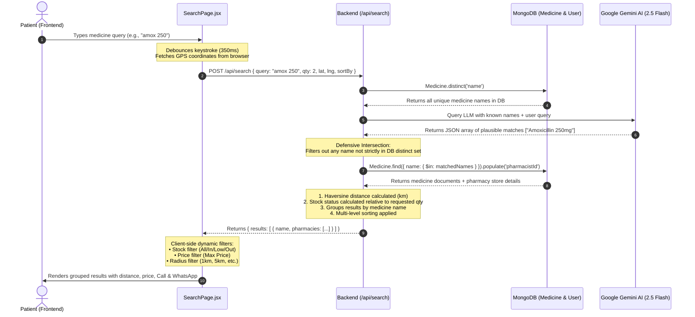

# 📘 MediSpot — Architecture, Roles & AI Search Guide

> **Target Audience:** All Team Members (Members 1, 2, 3, 4, 5)  
> **Purpose:** Comprehensive explanation of frontend code separation (User vs. Pharmacy/Pharmacist), end-to-end AI search pipeline, and file-by-file ownership.

---

## 📑 Table of Contents
1. [High-Level Architecture & User Roles](#1-high-level-architecture--user-roles)
2. [Frontend Code Breakdown: Where is User vs. Pharmacy Code?](#2-frontend-code-breakdown-where-is-user-vs-pharmacy-code)
   - [A. User (Patient / Customer) Code](#a-user-patient--customer-code)
   - [B. Pharmacy (Pharmacist) Code](#b-pharmacy-pharmacist-code)
   - [C. Shared UI Components & Infrastructure](#c-shared-ui-components--infrastructure)
3. [End-to-End Search Pipeline: How Search Works](#3-end-to-end-search-pipeline-how-search-works)
   - [Search Data Flow Diagram](#search-data-flow-diagram)
   - [Frontend Search Logic (Step-by-Step)](#frontend-search-logic-step-by-step)
   - [Backend Search Logic (Step-by-Step)](#backend-search-logic-step-by-step)
   - [AI LLM Fuzzy Matching & Hallucination Guard](#ai-llm-fuzzy-matching--hallucination-guard)
4. [Team Member Ownership Map](#4-team-member-ownership-map)
5. [Quick Testing & Verification Guide](#5-quick-testing--verification-guide)

---

## 1. High-Level Architecture & User Roles

MediSpot operates with two distinct user roles stored in MongoDB (`User.role`):

```
                       ┌──────────────────────────────┐
                       │       MediSpot Web App       │
                       └──────────────┬───────────────┘
                                      │
              ┌───────────────────────┴───────────────────────┐
              ▼                                               ▼
    ┌───────────────────┐                           ┌───────────────────┐
    │   role: 'user'    │                           │ role: 'pharmacist'│
    │ (Patient/Customer)│                           │ (Pharmacy Owner)  │
    ├───────────────────┤                           ├───────────────────┤
    │ • Searches drugs  │                           │ • Manages catalog │
    │ • Filters results │                           │ • Toggles stock   │
    │ • Checks distance │                           │ • Sets unit price │
    │ • Calls / WhatsApp│                           │ • Updates GPS pin │
    └───────────────────┘                           └───────────────────┘
```

---

## 2. Frontend Code Breakdown: Where is User vs. Pharmacy Code?

All frontend code lives under `frontend/src/`. Here is the exact directory breakdown:

```
frontend/src/
├── pages/
│   ├── AuthPage.jsx       <-- [USER & PHARMACY] Role-based Registration & Login
│   ├── SearchPage.jsx     <-- [USER] Medicine search, filtering, and pharmacy result cards
│   ├── DashboardPage.jsx  <-- [PHARMACY] Pharmacist inventory management (CRUD, stock, pricing)
│   └── ProfilePage.jsx    <-- [USER & PHARMACY] GPS pin picker & pharmacy contact details
├── components/
│   ├── Icon.jsx           <-- Shared SVG icon library
│   └── Primitives.jsx     <-- LocationPicker (Leaflet), ToastHost, Form Inputs, Skeletons
├── App.jsx                <-- Routing, Auth State, Role-based Route Guards
├── api.js                 <-- Central Axios client with JWT interceptor
└── index.css              <-- Global design tokens, typography, and micro-animations
```

---

### A. User (Patient / Customer) Code

| File | Purpose for User | Key Functions / UI Elements |
|:---|:---|:---|
| [`frontend/src/pages/SearchPage.jsx`](frontend/src/pages/SearchPage.jsx) | **The primary patient interface.** Allows patients to find medicines near them in real-time. | • `doSearch()` debounced query trigger<br>• Needed quantity counter (`reqQty`)<br>• Stock status filters (`All`, `In Stock`, `Low Stock`, `Out of Stock`)<br>• Distance & Price sorters (`Closest`, `Low to High`, `High to Low`)<br>• Distance radius filter (`1km`, `5km`, `10km`, `25km`)<br>• `PharmacyRow` result cards with direct Call & WhatsApp links |
| [`frontend/src/pages/AuthPage.jsx`](frontend/src/pages/AuthPage.jsx) | Registration & login for patients. | • Segmented role selector toggled to `"user"`<br>• Name, email, password fields<br>• Default location setup |
| [`frontend/src/pages/ProfilePage.jsx`](frontend/src/pages/ProfilePage.jsx) | User location configuration. | • Shows `"Patient Account"` badge<br>• Interactive Leaflet map to pinpoint home location so distance calculations are accurate |
| [`frontend/src/App.jsx`](frontend/src/App.jsx) | Navigation & Route Guarding for regular users. | • Directs users to `/search` upon login<br>• Blocks normal users from accessing `/dashboard` (redirects them back to `/search`)<br>• Top navigation displays `"Search"` and `"Location"` links |

---

### B. Pharmacy (Pharmacist) Code

| File | Purpose for Pharmacy | Key Functions / UI Elements |
|:---|:---|:---|
| [`frontend/src/pages/DashboardPage.jsx`](frontend/src/pages/DashboardPage.jsx) | **The core pharmacist interface.** Where pharmacists manage their store's medicine catalog. | • **Inventory Stats Cards:** Total medicines, in-stock count, out-of-stock count<br>• **Add Medicine Form:** Medicine name, quantity, unit price (LKR), in-stock toggle<br>• **Quick Stock Switch:** Instant toggle switch (`Toggle`) calling `PATCH /api/medicines/:id/stock`<br>• **Inline Quantity Stepper:** Increment/decrement quantity with live debounced update<br>• **Inline Price Editor:** Direct unit price editing with blur/Enter saving<br>• **Delete Action:** Two-step confirmation delete button |
| [`frontend/src/pages/AuthPage.jsx`](frontend/src/pages/AuthPage.jsx) | Registration for pharmacy owners. | • Segmented role selector toggled to `"pharmacist"`<br>• Additional pharmacy fields: **Pharmacy Phone** & **WhatsApp Number**<br>• Generates unique `pharmacyId` on the backend (e.g. `PH-XXXXXX`) |
| [`frontend/src/pages/ProfilePage.jsx`](frontend/src/pages/ProfilePage.jsx) | Pharmacy profile & location management. | • Shows `"Pharmacist · PH-XXXXXX"` badge<br>• Edit Pharmacy Phone & WhatsApp numbers<br>• Drag map pin to set exact pharmacy store coordinates for patient distance calculations |
| [`frontend/src/pages/SearchPage.jsx`](frontend/src/pages/SearchPage.jsx) *(Lines 15–118)* | `PharmacyRow` component (How the pharmacy appears to customers). | • Pharmacy name & `pharmacyId` badge<br>• Calculated distance from customer (`X.X km`)<br>• Stock availability badge (`In Stock`, `Low Stock`, `Out of Stock`)<br>• Unit price & calculated total price based on requested quantity<br>• One-tap `tel:` call button & `wa.me` WhatsApp direct chat button |

---

### C. Shared UI Components & Infrastructure

- **[`frontend/src/App.jsx`](frontend/src/App.jsx):**
  - Holds `user` state retrieved from `localStorage.getItem('ms_user')`.
  - Provides `<Require user={user} role="pharmacist">` guard to enforce role-based access.
  - Houses the global notification toast engine (`useToasts()`, `<ToastHost />`).
- **[`frontend/src/api.js`](frontend/src/api.js):**
  - Shared Axios instance targeting `import.meta.env.VITE_API_URL` or `http://localhost:5000/api`.
  - Automatically injects JWT token (`Authorization: Bearer <token>`) from `localStorage.getItem('ms_token')`.
- **[`frontend/src/components/Primitives.jsx`](frontend/src/components/Primitives.jsx):**
  - Contains reusable form inputs (`TextInput`, `PasswordInput`, `Field`).
  - Contains `<LocationPicker />` using Leaflet & OpenStreetMap to allow clicking/dragging map pins.
  - Contains skeleton loader cards for smooth loading states during search.

---

## 3. End-to-End Search Pipeline: How Search Works

### Search Data Flow Diagram



---

### Frontend Search Logic (Step-by-Step)

Located in: **[`frontend/src/pages/SearchPage.jsx`](frontend/src/pages/SearchPage.jsx)**

1. **Geolocation Detection (`useEffect`):**
   ```javascript
   useEffect(() => {
     if (!navigator.geolocation) return;
     navigator.geolocation.getCurrentPosition(
       pos => setUserCoords({ lat: pos.coords.latitude, lng: pos.coords.longitude }),
       () => {} // silently ignore if denied
     );
   }, []);
   ```
   When the user opens the page, browser coordinates are fetched. If granted, green indicator `Location detected ✓` appears.

2. **Debounced Search Trigger (`handleInput`):**
   - Keystrokes are debounced by **350ms** using `useRef(null)` and `clearTimeout`.
   - Prevents making an HTTP request on every single key press, saving server load and Gemini AI API quota.

3. **Backend Request (`doSearch`):**
   ```javascript
   const body = { query: q, qty: targetQty, sortBy: sort };
   if (userCoords) { body.lat = userCoords.lat; body.lng = userCoords.lng; }
   const { data } = await api.post('/search', body);
   setResults(data.results);
   ```

4. **Dynamic Stock Intelligence & Multi-Tier Filtering:**
   Even after receiving data, the client dynamically evaluates stock in real-time if the user changes the "Needed Qty" stepper:
   - **`In Stock`**: Pharmacy quantity $\ge$ Requested quantity.
   - **`Low Stock`**: Pharmacy has stock ($> 0$), but less than the requested quantity.
   - **`Out of Stock`**: Quantity $= 0$ or `inStock === false`.

5. **Client-Side Filters:**
   - **Stock Availability Filter**: Tabs for `All`, `In Stock` (green dot), `Low Stock` (amber dot), `Out of Stock` (red dot).
   - **Radius Filter**: Only displays pharmacies within 1km, 5km, 10km, or 25km.
   - **Max Price Filter**: Filters out options exceeding Rs. 250, Rs. 500, or Rs. 1000.
   - **Sorting**: Closest distance first, price low-to-high, or price high-to-low.

---

### Backend Search Logic (Step-by-Step)

Located in: **[`backend/src/controllers/searchController.js`](backend/src/controllers/searchController.js)**

1. **Endpoint:** `POST /api/search`
2. **Step 1: Extract Distinct Medicine Names:**
   ```javascript
   const distinctNames = await Medicine.distinct('name');
   ```
   Instead of searching arbitrary strings in MongoDB, it fetches only the medicine names that currently exist across all pharmacies.
3. **Step 2: AI Matching via Google Gemini 2.5 Flash:**
   Calls `queryLLM(distinctNames, query)` in `backend/src/utils/llm.js`.
   The prompt tells Gemini:
   > *"Given this JSON array of known medicine names [...] and this user search query: '...', return ONLY a JSON array of the exact strings from the list that could plausibly match (typos, abbreviations, partial names)."*
4. **Step 3: Defensive Intersection (Hallucination Guard):**
   ```javascript
   const distinctSet = new Set(distinctNames);
   const matchedNames = llmOutput.filter(
     (n) => typeof n === 'string' && distinctSet.has(n)
   );
   ```
   > [!IMPORTANT]
   > **Hallucination Protection:** Even if the AI model invents or hallucinates a drug name, `distinctSet.has(n)` strictly rejects it. Only actual database strings pass through!
5. **Step 4: Graceful Token Fallback:**
   If the Gemini API key is missing or encounters a rate limit (HTTP 429), `backend/src/utils/llm.js` automatically falls back to regex substring/token matching:
   ```javascript
   const qLower = query.toLowerCase().trim();
   const tokens = qLower.split(/\s+/).filter((t) => t.length > 1);
   return distinctNames.filter((name) => {
     const nLower = name.toLowerCase();
     return nLower.includes(qLower) || tokens.some((t) => nLower.includes(t));
   });
   ```
   Search **never crashes or breaks** during presentation or evaluation.
6. **Step 5: Pharmacy Population & Haversine Distance Calculation:**
   Matches are populated with pharmacist data (`name`, `lat`, `lng`, `phone`, `whatsapp`, `pharmacyId`).
   Distance is computed using the **Haversine formula** (`backend/src/utils/haversine.js`):
   $$d = 2r \arcsin \left( \sqrt{\sin^2\left(\frac{\Delta \text{lat}}{2}\right) + \cos(\text{lat}_1)\cos(\text{lat}_2)\sin^2\left(\frac{\Delta \text{lng}}{2}\right)} \right)$$
7. **Step 6: Grouping & Hierarchical Ordering:**
   Medicines are grouped by name, with in-stock pharmacies ranked before out-of-stock ones, and returned as clean JSON.

---

## 4. Team Member Ownership Map

| Member ID | Name | Role | Primary Files Owned |
|:---|:---|:---|:---|
| **IT24103408** | **Diluminda H.A.T.D** | Member 1 — Auth & Accounts | • `backend/src/models/User.js`<br>• `backend/src/controllers/authController.js`<br>• `frontend/src/pages/AuthPage.jsx`<br>• Route guards in `frontend/src/App.jsx` |
| **IT24103128** | **Dilmith K.H.T** | Member 2 — AI Search Lead | • `backend/src/controllers/searchController.js`<br>• `backend/src/utils/llm.js`<br>• `backend/src/utils/haversine.js`<br>• `frontend/src/pages/SearchPage.jsx` |
| **IT24103834** | **Lafry A.F.H** | Member 3 — Pharmacy Inventory | • `backend/src/models/Medicine.js`<br>• `backend/src/controllers/medicineController.js`<br>• `backend/src/routes/medicines.js`<br>• `frontend/src/pages/DashboardPage.jsx` |
| **IT24103637** | **Binuwara M.A.L** | Member 4 — Location & Profile | • `backend/src/controllers/userController.js`<br>• `backend/src/routes/users.js`<br>• `frontend/src/pages/ProfilePage.jsx`<br>• `LocationPicker` in `frontend/src/components/Primitives.jsx` |
| **IT24101601** | **Asma M.F** | Member 5 — App Shell, UI Kit & Integration | • `backend/src/index.js`<br>• `backend/src/config/db.js`<br>• `frontend/src/App.jsx`<br>• `frontend/src/api.js`<br>• `frontend/src/index.css`<br>• `frontend/src/components/Primitives.jsx` |

---

## 5. Quick Testing & Verification Guide

### Test Case 1: Verifying User vs. Pharmacist Access
1. Log in with a **Patient** account:
   - Header displays `Search` and `Location`.
   - Attempting to manually navigate to `/dashboard` immediately redirects to `/search`.
2. Log in with a **Pharmacist** account:
   - Header displays `Dashboard` and `Location`.
   - Access to `/dashboard` is granted, displaying the store inventory manager.

### Test Case 2: Verifying AI Fuzzy Search
1. Ensure at least one pharmacist has added `"Paracetamol"` or `"Amoxicillin 250mg"`.
2. In the search box, test the following queries:
   - Typo test: `"parasitamol"` $\rightarrow$ Successfully matches `Paracetamol`.
   - Partial abbreviation test: `"amox 250"` $\rightarrow$ Matches `Amoxicillin 250mg`.
   - Brand name / Alternate test: `"panadol"` $\rightarrow$ Plausibly matches `Paracetamol`.
3. Check stock badge dynamically switching between `In Stock`, `Low Stock`, and `Out of Stock` when adjusting the **Needed Qty** stepper.
4. Click **Call** or **WhatsApp** to confirm correct phone linking.
